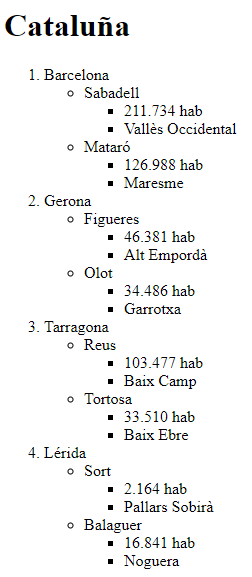

### Textos 01.

 Intentad crear una página web con títulos para ver cómo se ve.

- Que tenga títulos hasta ==h4==.
- Que tenga uno o dos parrafos por cada título.
- Añade en alguna parte las siguientes etiquetas:
  - ==strong==, ==em==, ==u== y ==mark== 

---

### Listas 01.

Cread una lista con el título "Cataluña" y que tenga 4 elementos.

- La lista principal tiene que ser ordenada y serán las 4 provincias que tiene Cataluña.
- Dentro de cada provincia pondremos de manera desordenada un par de ciudades que estén dentro de esas provincias.
- Por último dentro de esas ciudades haremos otra lista desordenada que diga cuantos habitantes tiene esa ciudad y también el nombre de una de sus comarcas.

