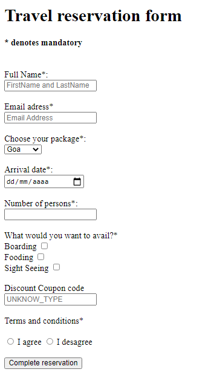

### Formularios 01.
Haz el siguiente formulario tal y como se ve en la imagen.
- En este caso, al no conocer aún cómo añadir estilos CSS podéis hacer los espacios en blanco con la etiqueta ` ` tanto para hacer que el `<label>` esté encima del `<input>` como para separar los inputs entre sí.

